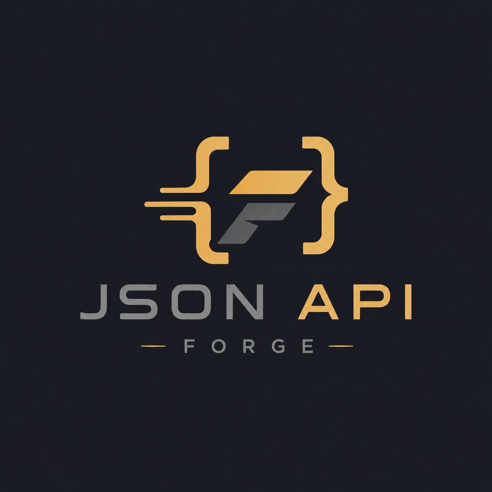

# JSON API Forge v0.5.2

[](https://github.com/YoungLionOrganization/JSON-API-Forge/actions/workflows/ci.yml?query=branch%3Amain)
[](https://github.com/YoungLionOrganization/JSON-API-Forge/actions/workflows/codeql.yml?query=branch%3Amain)
[](https://github.com/YoungLionOrganization/JSON-API-Forge/actions/workflows/server-builds.yml?query=branch%3Amain)
[](VERSION)
[](https://github.com/YoungLionOrganization/JSON-API-Forge/blob/main/pyproject.toml)
[](LICENSE)

<p align="center"></p>

**Config-first. Self-hosted. Multi-project. FastAPI-native.**

JSON API Forge turns strict, numbered JSON configuration into a real asynchronous backend: CRUD resources, transactional SQL/RPC operations, MongoDB resources, cache, rate limiting, media, data sources, realtime channels, authentication, OpenAPI and operational endpoints. Python hooks remain the explicit escape hatch for business logic that should not be forced into configuration.

> **v0.5.2 is in development and the project remains Alpha.** This server update fixes cache/data correctness, reduces startup overhead, improves request cancellation and introduces a verified manual publisher. See [release notes](release/notes/v0.5.2.md) and the [release procedure](RELEASE.md).

## Why JSON API Forge exists

Most backends repeatedly rebuild the same infrastructure: routing, CRUD, authorization, database plumbing, caching, rate limits, validation, OpenAPI, health checks and deployment glue. Forge makes those recurring concerns declarative while keeping the important boundaries explicit. The target is not “no code”; it is **less repetitive backend code and more visible architecture**.

A project lives under `app/<Project>/` and can be split into numbered fragments:

```text
app/MyService/
├── app.json
├── config/
│   ├── 10-databases.json
│   ├── 20-security.json
│   ├── 30-performance.json
│   ├── 40-resources.json
│   ├── 50-features.json
│   ├── 60-custom-endpoints.json
│   ├── 70-economy-rpc.json
│   └── 80-data-events.json
├── data/
├── graphs/
└── hooks/
```

Fragments are merged alphabetically and then validated by strict Pydantic models. Unknown configuration keys are rejected.

## v0.5.2 server changes

- **Security and data correctness:** SQL/Mongo resource caches isolate visibility and access policies while retaining shared invalidation. Heterogeneous SQL batches preserve fields and defaults atomically; ISO datetime writes/filters, nullable cursors, replacement defaults, BIGINT mapping and media cleanup have regression coverage.
- **Bounded waits:** request timeouts cancel the actual async endpoint before its admission slot is reused. DNS uses a separate executor; JWKS clients are reused, refresh attempts are coalesced and provider outages are throttled. Readiness probes have time and concurrency limits.
- **Startup and diagnosis:** HTTP clients are created only when needed, reflected tables are reused and schema creation checks only the current table. Protected stage histograms distinguish authentication, queue wait, schema setup and reflection/startup work.
- **Release delivery:** a manual `validate` → `draft` → `publish` workflow reuses successful platform artifacts and checks exact-SHA CI/CodeQL/build results, provenance, archive integrity, companion checksums and uploaded digests. Interrupted draft uploads can resume.

Existing configuration remains accepted. HTTP sources can opt into `total_timeout_seconds` to include retries and streamed reads in one budget; its default is `null`, preserving the existing per-phase `timeout_seconds` behavior. Async timeouts require cooperative cancellation: already-running synchronous hooks, blocking DNS calls and some database operations may continue until their driver/thread returns. Streaming lifetime after response headers is unchanged.

Controlled local measurements against the initial v0.5.2 development commit used **10 cold starts and 300 warm requests**. A 10-project Passenger first-request median fell from **143 ms to 36 ms**; warm medians stayed around **1.2 ms**. These measurements exclude hosting process creation and remote DB/network latency and do not establish that YoungLion's reported hosting delay is resolved. See the [full latency analysis, raw results and reproduction commands](docs/performance/v0.5.2-latency-analysis.md).

## v0.5.1 ecosystem baseline

The following describes the existing component baseline. This v0.5.2 server update does not update or release the independent Editor, SDK or example branches.

- `main` stays example-free and now validates bounded, schema-versioned, acyclic Editor graph documents behind the separate `EDITOR_ALLOW_GRAPHS` policy.
- The control plane uses one-time founder setup, hashed worker credentials, expiring sessions, ranked/scoped roles, project/document/database policy and append-only audit records; the shared-token mode is development-only compatibility.
- The `Editor` branch adds a C++20/Qt 6 node-and-wire graph, code/typed visual modes, account/team/database workspaces, Amber Gold + Graphite Gray branding, eight atomic templates, Python SDK integration and a digest-verified Plugin API v2.
- The Editor can browse plugin release records and explicitly import bounded, digest-verified ZIP packages; imported native plugins remain disabled until reviewed and enabled.
- The `python-library` branch adds sync/async retry observability, bounded pagination/bulk work, multi-region routing, circuit breakers and safe failover. Optional `[younglion]` and `[ddm]` extras keep those integrations lazy.
- The `exampleApps` branch contains 25 named applications with schema, CRUD, RPC, idempotency, realtime and graph smoke coverage.
- External JWKS and HTTP data-source egress now share fail-closed URL, redirect, response-size and private-network policy boundaries.
- Configured request/JSON Schema regexes use a bounded linear-time engine, and malformed CORS/header/ICE metadata is rejected at configuration load.
- The v0.5.0 discovery, authorization, concurrency, proxy, credential and control-plane hardening remains in force.
- Python 3.10–3.14, live PostgreSQL 17/Redis 8/MongoDB 8, package, TypeScript, container, manifest and CodeQL gates remain required.

## Choose a component

The four branches are separate products with their own source packages and workflows.

| Branch | Purpose | Start here |
|---|---|---|
| [`main`](https://github.com/YoungLionOrganization/JSON-API-Forge/tree/main) | FastAPI server, CLI, schemas and operational docs | [Server installation](https://github.com/YoungLionOrganization/JSON-API-Forge/blob/main/INSTALL.md) |
| [`Editor`](https://github.com/YoungLionOrganization/JSON-API-Forge/tree/Editor) | Native Qt desktop authoring and team workspace | [Editor guide](https://github.com/YoungLionOrganization/JSON-API-Forge/blob/Editor/EDITOR.md) |
| [`python-library`](https://github.com/YoungLionOrganization/JSON-API-Forge/tree/python-library) | Typed synchronous/asynchronous Python SDK | [SDK guide](https://github.com/YoungLionOrganization/JSON-API-Forge/blob/python-library/PYTHON_LIBRARY.md) |
| [`exampleApps`](https://github.com/YoungLionOrganization/JSON-API-Forge/tree/exampleApps) | 25 copy-ready reference applications | [Example catalog](https://github.com/YoungLionOrganization/JSON-API-Forge/blob/exampleApps/EXAMPLE_APPS.md) |

## Quick start

```bash
git clone --branch main --single-branch https://github.com/YoungLionOrganization/JSON-API-Forge.git
cd JSON-API-Forge
bash scripts/install.sh         # Windows: .\scripts\install.ps1
source .venv/bin/activate        # Windows: .\.venv\Scripts\Activate.ps1

forge new MyService --slug my-service
forge init
forge validate
forge doctor
forge dev
```

After release assets are attached to GitHub Releases, install a checksum-verified, platform-matched standalone build with `./scripts/install.sh --release` or `.\scripts\install.ps1 -Release`. The build workflow produces glibc/musl Linux, Windows, macOS, OCI, wheel/source and cPanel/Passenger artifacts for x64/ARM64 where the platform supports them.

The generated project documentation is available at `/api/my-service/v1/_docs` once the server is running. See [`INSTALL.md`](INSTALL.md) for editable, Git-ref and Docker installation paths.

### Development reload and app isolation

JSON app changes are applied after a debounce without closing the listener. Invalid edits retain the app's last valid configuration, and unchanged apps keep their services. `APPS_AUTO_RELOAD=false` disables JSON watching. `forge dev --reload` separately restarts the development worker for Python-hook changes; `--no-reload` disables that Python reloader. Data/media writes are excluded. See [reload and failure boundaries](docs/44-Development-Reload-and-App-Isolation.md).

For a first reference project, install [TaskBoard from exampleApps](https://github.com/YoungLionOrganization/JSON-API-Forge/tree/exampleApps/app/TaskBoard). Production deployment guidance is separate from the development reloader.

## Core model

### Projects
Each directory under `app/` containing `app.json` or a valid manifest is an independent project. Projects have isolated prefixes, data services, roles, resources and runtime state.

### Resources
SQL resources define table/column metadata, allowed actions, filters, sorts, write fields, tenant/owner policies, cache rules and permissions. Generic CRUD is intentionally bounded by declarative policy.

### Operations / RPC
Operations execute predeclared parameterized SQL. They support transactions, row-count guards, JSON Schema inputs, cache/invalidation, and same-database transactional idempotency. User input is bound as values; it is never intended to become SQL text.

### MongoDB
Mongo resources expose bounded CRUD over configured collections. Tenant, owner and soft-delete policy fields are server-controlled.

### Data sources and API gateway
Static, JSON/YAML/CSV file and controlled outbound HTTP sources can be exposed declaratively. Outbound networking includes redirect and size controls; production deployments should still enforce network-level egress rules.

### Realtime
SSE and WebSocket event channels can use process-local memory or Redis pub/sub. Delivery is best-effort, not a durable message queue.

### Media
Forge implements a local-filesystem media backend with upload limits, MIME/extension allowlists, owner quotas, deduplication, signed URLs and metadata isolation. Object storage is not claimed as implemented.

### Security
- API keys are project-scoped.
- Bootstrap admin access is explicit and can be one-time.
- JWT is opt-in and can use local HS256 or external JWKS.
- SQL/custom/data/event surfaces are private unless explicitly public.
- Delegated credentials cannot silently exceed the issuer’s authority without an explicit high-trust permission.
- Trusted proxy CIDRs control whether forwarded IP/protocol headers are accepted.
- Process-level metrics/detailed readiness use a separate operator credential.

### Dedicated editor control plane

The `Editor` branch contains the C++/Qt desktop editor. A server only exposes its management surface when `EDITOR_API_ENABLED=true`. `EDITOR_TOKEN` is accepted only once to create the founder account; workers then use invitation-scoped accounts and short-lived bearer sessions, never application API keys. The server independently enforces HTTPS, source IP and Host allowlists, role rank, project/document/database scopes, read-only mode, project creation, Python-hook editing and graph editing. See [`docs/42-Editor-Control-Plane.md`](docs/42-Editor-Control-Plane.md).

## CLI

```text
forge init                 create a safe local .env
forge new NAME             create a project
forge dev                  run a development server
forge validate             strictly validate project configuration
forge doctor               report configuration/production problems
forge doctor --production  apply production-focused diagnostics
forge routes               print generated routes
forge openapi              generate OpenAPI
forge schema               regenerate JSON Schemas
forge migrate              create required support/schema objects explicitly
forge secrets              secret tooling
```

Run `forge --help` and command-specific help for current options.

## Testing and release gates

The official CI targets:

- Python 3.10, 3.11, 3.12, 3.13 and 3.14;
- branch-aware aggregate and high-risk per-module coverage gates;
- PostgreSQL 17, Redis 8 and MongoDB 8 live-service integration tests;
- TypeScript type checking on Node 22;
- package build and Docker image build;
- CodeQL;
- tracked-source `MANIFEST.sha256` verification;
- standalone platform builds and artifact/checksum validation;
- an exact-commit manual publisher that requires successful latest `main` push runs of CI, CodeQL and platform builds. The existing tag-only CI gate is supplementary.

The `python-library`, `Editor` and `exampleApps` branches have branch-specific build workflows. They produce downloadable artifacts but do not publish packages or releases automatically.

Latest local v0.5.2 validation on Python 3.12: **166 tests passed, 7 external-service tests skipped, 81.35% branch-aware coverage**, with critical module floors passing. Lint/format, manifest and wheel/sdist checks passed. Local results do not replace the GitHub Python matrix, live-service integration, container, CodeQL or platform build results.

```bash
pytest -q --cov=framework --cov-report=json
python scripts/check_critical_coverage.py
python scripts/check_manifest.py
python scripts/benchmark_latency.py --repeats 10
```

For an official server release, merge the reviewed source and follow [`RELEASE.md`](RELEASE.md). The publisher creates the lightweight tag from the verified commit; manually creating an annotated tag is not this publisher's release path.

## Documentation

Start with [`docs/00-Start-Here.md`](docs/00-Start-Here.md). The documentation then moves through architecture, configuration, security, databases, operations, realtime, media, production, testing and failure modes. [docs/README.md](docs/README.md) is the full index, with task-oriented reading paths.

## Deployment

Native ASGI/Uvicorn is the preferred runtime, especially for SSE/WebSockets. Docker is supported through the included `Dockerfile`. A Passenger/a2wsgi bridge is included for conventional cPanel-style HTTP deployments, but it is not the preferred environment for sustained realtime workloads.

See [`docs/43-Platform-and-Hosting-Matrix.md`](docs/43-Platform-and-Hosting-Matrix.md) for Windows/Windows Server, mainstream and specialist Linux distributions, Alpine/musl, macOS, containers, cPanel/Passenger and reverse-proxy deployment paths.

## Known limits

Forge v0.5.x is Alpha. In particular:

- same-database idempotency is not cross-system exactly-once delivery;
- realtime is not a durable broker;
- local media is not horizontally shared object storage;
- declarative SQL is trusted configuration, not an attacker-safe SQL sandbox;
- memory backends are process-local;
- schema auto-creation is not a complete production migration framework;
- request deadlines cannot forcibly terminate blocking driver/thread work or remove hosting cold-start delays.

See [known limitations](KNOWN_LIMITATIONS.md) and [non-goals](docs/41-Known-Limits-and-Non-Goals.md).

## License and contribution

JSON API Forge uses the **source-available** [Self-Host License 1.1](LICENSE), identified by `LicenseRef-JAF-SASH-1.1`. Commercial self-hosting and private modification are permitted under its terms; redistribution and alternative distributions require the permission described there. See the [license FAQ](LICENSE-FAQ.md), [license history](LICENSE-HISTORY.md), [third-party notices](THIRD_PARTY_NOTICES.md), [trademark policy](TRADEMARK_POLICY.md) and [AI contribution policy](AI_USAGE_POLICY.md).

Official distribution is controlled by Cavanşir Qurbanzadə (`@Cavanshirpro`) or a lawful successor/assignee. For contributions, follow [CONTRIBUTING.md](CONTRIBUTING.md) and the [CLA](CONTRIBUTOR_LICENSE_AGREEMENT.md). Report vulnerabilities through [SECURITY.md](SECURITY.md); use [GitHub issues](https://github.com/YoungLionOrganization/JSON-API-Forge/issues) for reproducible bugs and feature proposals. Include the component, platform and version, with secrets removed from logs.
